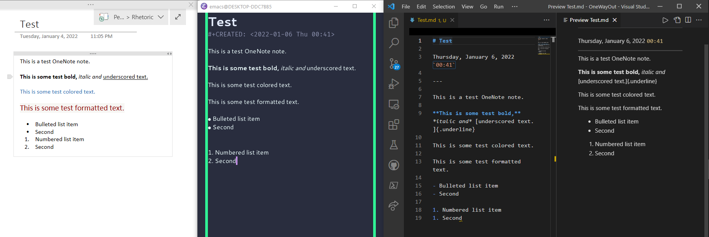

# `o`ne`w`ay`o`ut

`owo` allows you to transform all your OneNote notes into Emacs Org Mode, or any other [Pandoc-supported Markdown](https://pandoc.org/), using the OneNote Object Model and Pandoc. Say farewell to OneNote or back up your notes, in plain text [tailored for you](#introduction)!

`owo` is built on the foundation of [ConvertOneNote2Markdown](https://github.com/theohbrothers/ConvertOneNote2Markdown), by

* [SjoerdV](https://github.com/SjoerdV)
* [nixsee](https://github.com/nixsee/)
* [theohbrothers](https://github.com/theohbrothers)

---

### Table of Contents

[**Introduction**](#introduction)

[**Results**](#results)

[**Requirements**](#requirements)

[**Usage**](#usage)

[**Recommendations**](#recommendations)

[**Known Issues**](#known-issues)

---

## Introduction

`owo` exports OneNote pages to Word using the OneNote Object Model, and uses Pandoc to convert them to your markup format of choice. [**Markup Packs**](https://github.com/alopezrivera/owo/tree/master/src/Conversion/Markup-Packs) are then used to customize the result. Markup Packs are *markup-format-specific* **functions** containing search and replace queries executed at runtime against the text output by Pandoc to tailor it to our desires. If search and replace doesn't cut it, you can add a `postprocessing` scriptblock to increase your freedom. Markup Packs give you fine-grained control over of all elements of your notes, including

* Headers
* Metadata (eg: note creation date)
* Other markup elements such as horizontal lines, custom indentations and formatting, and whatever else you might be able to conjure up with the text in your notes

`owo` currently ships Markup Packs for [Emacs Org Mode](https://github.com/alopezrivera/owo/blob/master/src/Conversion/Markup-Packs/Org.psm1) (`OrgPack1`) and [Markdown](https://github.com/alopezrivera/owo/blob/master/src/Conversion/Markup-Packs/Markdown.psm1) (`MarkDownPack1`).

### What is being exported?

`owo` will export all your *local* OneNote notebooks, meaning that to export a notebook of yours, you will need to download it to OneNote >= 2016[*](#requirements) with the "Add Notebook" option.

### Customizing output and adding support for further export formats

As long as Pandoc supports your desired output format, all `owo` needs to shine is a Markup Pack to tailor the output to your tastes. [CONTRIBUTING.md](https://github.com/alopezrivera/owo/blob/master/CONTRIBUTING.md) has the pointers you need to write your own Markup Packs, add support for other Markup formats, and more.

## Results

As you can see above, the Markup Packs shipping for Org Mode and Markdown will provide you with

* Note creation metadata (in the case of Org Mode, in its standard date format)
* Correctly rendered lists and nested lists, numbered and unnumbered
* Correctly rendered indented paragraphs
* All while cleaning the output of artifacts, excess newlines, etc

Some notes:

* As expected, elaborate formatting doesn't survive export
* Underscored text is annotated as such in Markdown, but does not render correctly (at least in VSCode)
* Images resized within OneNote are rendered with an annotation to that effect. This may cause them not to render correctly (tested on VSCode)

## Requirements

* Windows >= 10

* Windows Powershell 5.x and above, or [Powershell Core 6.x up to 7.0](https://github.com/PowerShell/PowerShell)

* Microsoft OneNote
  > \>= 2016 (Desktop version, **NOT the Windows Store version**)
  * Download: FREE - https://www.onenote.com/Download

* Microsoft Word
  > \>= 2016 (Desktop version, **NOT the Windows Store version**)
  * Download: Office 365 Trial - https://www.microsoft.com/en-us/microsoft-365/try

* [PanDoc >= 2.2.3.2](https://pandoc.org/installing.html)

  * TIP: You may also use [Chocolatey](https://chocolatey.org/docs/installation#install-with-powershellexe) to install Pandoc on Windows, this will also set the right path (environment) statements. (https://chocolatey.org/packages/pandoc)

## Usage

1. Clone this repository
1. Start the OneNote desktop application
1. Rename `config.example.ps1` to `config.ps1` and configure options in `config.ps1` to your liking.
1. Open a PowerShell terminal at the directory containing the script and run it.
      * `.\owo.ps1`
1. Sit back and wait until the process completes. To stop the process at any time, press Ctrl+C.
* **While running the conversion OneNote will be unusable**, as the Object Model might be interrupted if OneNote is used through the conversion process.

### Options

All of the following are configured from `config.ps1` (assuming you have renamed `config example.ps1` to that).

* Choose to do a dry run or run the actual conversion.
* Create a **folder structure** for your Notebooks and Sections
  * Process pages that are in sections at the **Notebook, Section Group and all Nested Section Group levels**
* Choose between converting a **specific notebook** or **all notebooks**
* Choose between creating **subfolders for subpages** (e.g. `Page\Subpage.md`) or **appending prefixes** (e.g. `Page_Subpage.md`)
* Specify a value between `32` and `255` as the maximum length of markdown file names, and their folder names (only when using subfolders for subpages (e.g. `Page\Subpage.md`)). A lower value can help avoid hitting [file and folder name limits of `255` bytes on file systems](https://en.wikipedia.org/wiki/Comparison_of_file_systems#Limits). A higher value preserves a longer page title. If using page prefixes (e.g. `Page_Subpage.md`), it is recommended to use a value of `100` or greater.
* Choose between putting all media (images, attachments) in a central `/media` folder for each notebook, or in a separate `/media` folder in each folder of the hierarchy
  * Symbols in media file names removed for link compatibility
  * Updates media references in the resulting `.md` files, generating **relative** references to the media files within the markdown document
* Choose between **discarding or keeping intermediate Word files**. Intermediate Word files are stored in a central notebook folder.
* Choose between converting from existing `.docx` (90% faster) and creating new ones - useful if just want to test differences in the various processing options without generating new `.docx` each time
* Choose between naming `.docx` files using page ID and last modified epoch date e.g. `{somelongid}-1234567890.docx` or hierarchy e.g. `<sectiongroup>-<section>-<page>.docx`
* **Input the Pandoc call, including conversion format and any extensions**, defaulting to Pandoc Markdown format which strips most HTML from tables and using pipe tables. [See more details on these options here](https://pandoc.org/MANUAL.html#options). Default configurations are provided in `config example.ps1`. The following formats are accepted, among others:
  * org (Emacs Org Mode)
  * markdown (Pandoc’s Markdown)
  * commonmark (CommonMark Markdown)
  * gfm (GitHub-Flavored Markdown), or the deprecated and less accurate markdown_github; use markdown_github only if you need extensions not supported in gfm.
  * markdown_mmd (MultiMarkdown)
  * markdown_phpextra (PHP Markdown Extra)
  * markdown_strict (original unextended Markdown)
* Choose whether to use a **default Markup Pack, a specific one, or none** if you want to remove all post-processing (useful for debugging purposes).
* Choose whether to include a page timestamp and separator at top of the page.
* Choose whether to remove double spaces between numbered and unnumbered lists, excess whitespace after list markers, non-breaking spaces from blank lines, and `>` after bullet lists, created by Pandoc
* Choose whether to remove `\` escape symbol that are created when converting with Pandoc
* Choose whether to use Line Feed (LF) or Carriage Return + Line Feed (CRLF) for new lines
* Choose whether to include a `.pdf` export alongside the `.md` file. `.md` does not preserve `InkDrawing` (i.e. overlayed drawings, highlights, pen marks) absolute positions within a page, but a `.pdf` export is a complete page snapshot that preserves `InkDrawing` absolute positions within a page.

## Recommendations

1. You may want to consider using VS Code and its embedded Powershell terminal, as this allows you to edit and run your configuration and check conversion results. To make things easier, consider setting `$notesdestpath` in `config.ps1` to a `notes` directory in the project while adjusting the settings to your preference.
1. If you aren't actively editing your pages in OneNote, it is highly recommended that you don't delete the intermediate Word docs, as their generation takes a large part of runtime. They are stored in their own folder, out of the way. You can then quickly re-run the script with different parameters until you find what you like.
1. If you happen to collapse paragraphs in OneNote, consider installing [Onetastic](https://getonetastic.com/download) and the [attached macro](https://github.com/alopezrivera/owo/blob/master/Expand%20All%20Paragraphs%20in%20Notebook.xml), which will automatically expand any collapsed paragraphs in the notebook. They won't be exported otherwise.
   * To install the macro, click the New Macro Button within the Onetastic Toolbar and then select File -> Import and select the .xml macro included in the release.
   * Run the macro for each Notebook that is open
1. Unlock all password-protected sections before continuing, the Object Model will not have access to them otherwise

## Known Issues

1. Inline image paths are relative. In some editors, this can cause the images to not render, even if the links are clickable (tested on VSCode).
1. If you collection is rather large, your computer may **run out of memory** before finishing the process. It is very highly recommended that you save the Word files produced so you can start back up with minimal loss of time. In case this becomes a serious problem and you cannot easily continue, consider exporting your collection **notebook by notebook** (check your `config.ps1`).

Furthermore, as reported in [ConvertOneNote2Markdown](https://github.com/theohbrothers/ConvertOneNote2Markdown):

3. You should start by 'flattening' all `InkDrawing` (i.e. pen/hand written elements) in your onennote pages. Because OneNote does not have this function you will have to take screenshots of your pages with pen/hand written notes and paste the resulting image and then remove the scriblings. If you are a heavy 'pen' user this is a very cumbersome.
   * Alternatively, if you are converting a notebook only for reading sake, and want to preserve all of your notes' layout, instead of flattening all `InkDrawing` manually you may prefer to export a  `.pdf` which preserves the full apperance and layout of the original note (including `InkDrawing`). Simply use the config option `$exportPdf = 2` to export a `.pdf` alongisde the markup file.

---

[Back to top](#onewayout-owo)
